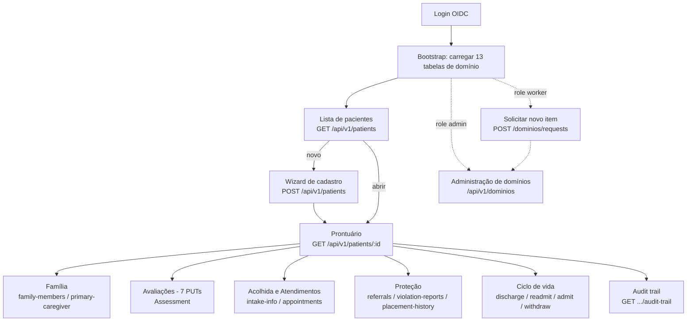

# Fluxo de Integração Frontend ↔ social-care

Guia para o time de frontend (Flutter, via BFF) construir as telas sobre a API do `social-care`. Os cenários Gherkin dos arquivos `01`–`04` são os **critérios de aceite** de cada tela descrita aqui.

## 1. Pré-requisitos transversais

- **Auth**: todo request (exceto `/health`/`/ready`) leva `Authorization: Bearer <jwt>` do OIDC (Authentik/Zitadel). O BFF **deve encaminhar o Bearer recebido em toda chamada outbound** — o backend deriva o `actorId` do `JWT.sub` validado e ignora qualquer header customizado (ADR-023).
- **Envelopes**: sucesso vem em `{ "data": ..., "meta": { "timestamp" } }` (`StandardResponse`); listagens em `PaginatedResponse` com `meta.pageSize/totalCount/hasMore/nextCursor`; erro vem em `{ "error": { "code", "message" } }`.
- **Formatos**: datas ISO-8601; dinheiro como `Double`; UUIDs como string; enums como string; body máx. 256 KB.
- **Roles e UI**: a UI deve esconder/desabilitar ações que a role do usuário não permite (matriz no arquivo `04`), mas tratar 403 graciosamente mesmo assim — o backend é a autoridade.

## 2. Mapa geral do fluxo



## 3. Passo 0 — Bootstrap (após login)

Carregar e cachear as 13 tabelas de domínio que populam todos os selects do app:

```
GET /api/v1/dominios/dominio_tipo_identidade      → identidade social (cadastro)
GET /api/v1/dominios/dominio_parentesco           → família
GET /api/v1/dominios/dominio_condicao_ocupacao    → trabalho e renda
GET /api/v1/dominios/dominio_escolaridade         → educação
GET /api/v1/dominios/dominio_efeito_condicionalidade → educação (ocorrências)
GET /api/v1/dominios/dominio_tipo_deficiencia     → saúde
GET /api/v1/dominios/dominio_programa_social      → acolhida
GET /api/v1/dominios/dominio_tipo_ingresso        → acolhida
GET /api/v1/dominios/dominio_tipo_beneficio       → socioeconômico (+ flags!)
GET /api/v1/dominios/dominio_tipo_violacao        → violações (+ flag exige_descricao)
GET /api/v1/dominios/dominio_servico_vinculo      → encaminhamentos
GET /api/v1/dominios/dominio_tipo_medida          → proteção
GET /api/v1/dominios/dominio_unidade_realizacao   → atendimentos
```

Cache com TTL curto (ex.: sessão) — admins podem alterar itens. Os itens vêm só com `ativo=true`; nunca hardcodar opções no app.

## 4. Formulários dirigidos por metadado

Itens de `dominio_tipo_beneficio` e `dominio_tipo_violacao` carregam flags que tornam campos do formulário condicionalmente obrigatórios:

| Flag no item de lookup | Campo que vira obrigatório | Onde |
|---|---|---|
| `exigeRegistroNascimento` | `birthCertificateNumber` | benefício social (socioeconômico / trabalho-renda) |
| `exigeCpfFalecido` | `deceasedCpf` | benefício social |
| `exigeDescricao` | `descriptionOfFact` | relato de violação |

Validar no cliente ao selecionar o tipo (UX), sabendo que o backend devolve 422 se burlado (autoridade).

## 5. Telas e contratos

### 5.1 Lista de pacientes
- `GET /api/v1/patients?search=&status=&limit=20&cursor=` — devolve `PatientSummaryResponse` (`patientId`, `fullName`, `primaryDiagnosis`, `memberCount`, `status`).
- Paginação **cursor-based**: usar `meta.nextCursor` para a próxima página; `meta.hasMore=false` encerra o scroll infinito. `limit` aceita 1–100.

### 5.2 Wizard de cadastro (`POST /api/v1/patients`, role `worker`)
Etapas sugeridas, espelhando o `RegisterPatientRequest`:
1. **Vínculo**: `personId` (vindo do people-context) + `prRelationshipId`.
2. **Diagnósticos** (mín. 1): `icdCode` (CID-10), `date` (não-futura), `description`.
3. **Dados pessoais** (opcional): nome, nome da mãe, nacionalidade, `sex` (`masculino|feminino|outro`), `birthDate`, telefone.
4. **Documentos civis** (opcional): CPF (validar dígito no cliente), NIS, RG, CNS (CPF do CNS deve coincidir).
5. **Endereço** (opcional): CEP coerente com UF, `isShelter`, `residenceLocation` (`VILLAGE|URBAN|RURAL`).
6. **Identidade social** (opcional): `typeId` + `description` quando o tipo exigir.

Tratamento específico: `409 REGP-030` (CPF já cadastrado → oferecer abrir o paciente existente), `409 REGP-001` (personId já registrado), `503 REGP-031` (people-context fora → manter o formulário preenchido e oferecer retry).

### 5.3 Prontuário
`GET /api/v1/patients/:patientId` devolve o agregado completo — uma chamada alimenta todas as abas: `personalData`, `civilDocuments`, `address`, `familyMembers`, `diagnoses`, as 7 avaliações, `intakeInfo`, `appointments`, `referrals`, `violationReports`, `placementHistory` e **`computedAnalytics`** (densidade habitacional, rendas per capita, perfil etário, vulnerabilidades educacionais — exibir como indicadores, nunca recalcular no cliente).

### 5.4 Abas de edição
Cada aba de avaliação faz `PUT` do objeto completo (substituição, não merge) e em seguida refaz o `GET` do prontuário para atualizar os analytics. Endpoints e regras nos arquivos `02` e `03`.

### 5.5 Ciclo de vida
Botões por status atual (`worker` e `admin`):

| Status atual | Ações visíveis |
|---|---|
| `ACTIVE` | Discharge (exige `reason`) |
| `DISCHARGED` | Readmit |
| `WAITLISTED` | Admit, Withdraw (exige `reason`) |
| `ADMITTED` | Discharge |

409 nessas ações significa estado mudou em outra sessão → recarregar o paciente.

### 5.6 Administração de domínios (role `admin`) e solicitações (role `worker`)
- Admin: CRUD em `/api/v1/dominios/:tableName` (códigos UPPER_SNAKE_CASE; toggle pode falhar com `409 LKP-005` se o item estiver em uso — explicar isso na UI).
- Worker: propõe item via `POST /api/v1/dominios/requests` (com `justificativa`) e acompanha status `PENDING|APPROVED|REJECTED` (vê só as suas). Admin aprova/rejeita (rejeição exige `reviewNote`, que deve ser exibido ao solicitante).

## 6. Tratamento de erros padronizado (camada única no app/BFF)

| HTTP | Significado | Ação da UI |
|---|---|---|
| 400 | Payload malformado / parâmetro inválido | Mensagem no campo; é bug de cliente — logar |
| 401 | Token ausente/expirado/inválido | Renovar token (refresh) e repetir 1x; senão, voltar ao login |
| 403 | Role insuficiente | Toast "sem permissão"; revisar visibilidade do botão |
| 404 | Recurso não existe | Voltar à lista com aviso |
| 409 | Conflito (CPF duplicado, estado mudou, item em uso) | Mensagem específica por `error.code` + recarregar dado |
| 413 | Body > 256 KB | Reduzir payload (ex.: anexos) |
| 422 | Regra de negócio (CPF-*, validação cruzada, metadado) | Mostrar `error.message` no campo/formulário |
| 503 | Dependência fora (people-context) | Preservar formulário + botão "tentar novamente" |
| 500 | Erro interno | Mensagem genérica + correlação para suporte |

Mapear por `error.code` (prefixos `CPF-`, `NIS-`, `CEP-`, `REGP-`, `LKP-`, `LKR-`) quando precisar de mensagem mais específica que a do backend.

## 7. Ordem recomendada de implementação (incrementos verticais)

1. **Login + bootstrap de domínios + lista de pacientes** (leitura pura — valida auth, envelopes e paginação).
2. **Prontuário read-only** (consome o agregado inteiro + analytics).
3. **Wizard de cadastro** (primeiro fluxo de escrita; exercita CPF/CEP/CNS e os 409/503).
4. **Família + acolhida + atendimentos**.
5. **As 7 avaliações** (formulários dirigidos por metadado).
6. **Proteção** (violações, encaminhamentos, acolhimento institucional).
7. **Ciclo de vida + audit trail + administração de domínios**.

Cada incremento fecha quando os cenários Gherkin correspondentes (arquivos `01`–`04`) passam contra o ambiente de DEV.
